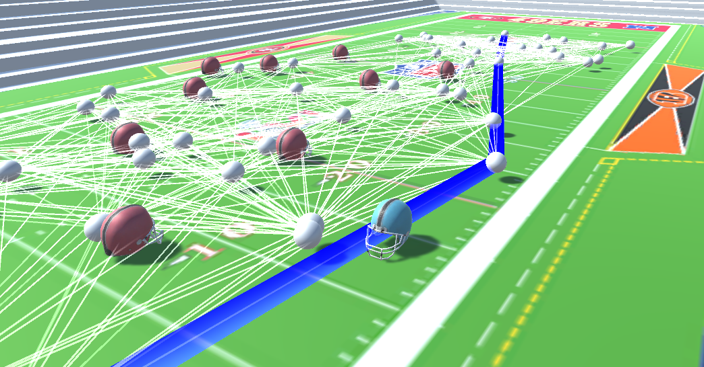

# Project1-5611


## Images of your agent(s) navigating their environments 



## A brief description of the features of your implementation and timestamp of where they occur in your video(s). 

- 00:00:07 - Start the scene, it randomizes the position of the defenders (starting with 11 as default)
- 00:00:08 - Utlize the camera and 3d enviornment. Right click allows one to move around camera about the center of the field up and down(values are clamped though) to see a top down view and 360 angles.
- 00:00:18 - Randomize the field by pressing down on 'r' moves around all defenders currently on the ground
- 00:00:21 - User scenario editing. Add defenders wherever you want by left clicking the position desired.
- 00:00:30 - See nodes of pathways connected with there neighbors.
- 00:00:37 - push 'b' to darken the route to allow you to get to the endzone.
- 00:00:45 - push 'g' to go to the endzone along the route
- 00:01:00 - push 'd' to destroy all lines and nodes

## An explicit list of which features you attempted 
- Single Agent Navigation
- 3D Rendering & Camera
- Improved Agent & Scene Rendering 
- User Scenario Editing+

## Code you wrote 
[FootballAnimation.cs](Assets/FootballAnimation.cs)
```c#
using System.Collections;
using System.Collections.Generic;
using UnityEngine;

public class FootballAnimation : MonoBehaviour
{
    public GameObject currentHitObject;

    static int numDefenders = 11;
    public GameObject[] Defenders = new GameObject[numDefenders];
    List<GameObject> defenderList = new List<GameObject>(); 
    public GameObject Runner;
    GameObject sphereNode;
    List<GameObject> sphereNodes = new List<GameObject>();
    List<GameObject> lines = new List<GameObject>();
    public LayerMask layerMask;

    public GameObject defaultDefender;

    float distBetweenDefenders = 1f;

    static int numNodes = 50;
    bool moveToPath = false;
    float defaultStrokeWidth = 0.01f;
    float speed = 1f;

    // Start is called before the first frame update
    void Start()
    {
        foreach(GameObject defender in Defenders)
        {
           defenderList.Add(defender);
        }
        setDefenders();
        //defenderList[0].transform.position = new Vector3(2, 0.1805401f, 0);
        //Runner.transform.position = new Vector3(0, 0.1805401f, 0);
        //generateSphere(.25f, new Vector3(0, 0.1805401f, 0));
        //nodePos[0] = new Vector3(0, 0.1805401f, 0);

        //generateSphere(.25f, new Vector3(3, 0.1805401f, 0));
        //nodePos[1] = new Vector3(3, 0.1805401f, 0);

        //connectNeighbors();
    }

    void destroyNodes()
    {
        foreach (GameObject node in sphereNodes)
        {
            Destroy(node);

        }
        foreach (GameObject line in lines)
        {
            Destroy(line);
        }
    }

    void drawLine(Vector3 start, Vector3 end, Color color, float stroke)
    {
        GameObject newLine = new GameObject();
        newLine.transform.position = start;
        newLine.AddComponent<LineRenderer>();

        LineRenderer lr = newLine.GetComponent<LineRenderer>();
        lr.sortingLayerName = "Lines";
        lr.material = new Material(Shader.Find("Legacy Shaders/Particles/Alpha Blended Premultiply"));
        lr.SetWidth(stroke, stroke);
        lr.startColor = color;
        lr.endColor = color;

        lr.SetPosition(0, start);
        lr.SetPosition(1, end);
        lines.Add(newLine);

    }

    void setDefenders()
    {
        foreach (GameObject defender in defenderList)
        {
            defender.transform.position = new Vector3(Random.Range(0, 7.5f), 0.1805401f, Random.Range(-3.1f, 3.1f));
        restart:
            foreach (GameObject otherDefender in defenderList)
            {
                if (otherDefender == defender)
                {
                    continue;
                }
                if (Vector3.Distance(otherDefender.transform.position, defender.transform.position) <= distBetweenDefenders)
                {
                    defender.transform.position = new Vector3(Random.Range(0, 7.5f), 0.1805401f, Random.Range(-3.1f, 3.1f));
                    goto restart;
                }
            }
            //Debug.Log(defender.transform.position);

        }
    }

    bool pointInCircle(Vector3 center, float r, Vector3 pointPos)
    {
        float dist = Vector3.Distance(pointPos, center);
        if (dist < r * 2)
        { //small safety factor
            return true;
        }
        return false;
    }
    // pointsInGoal(new Vector3(9.02999973f, 0.167999998f, 3.20000005f), 2.1f, nodePos);
    List<int> pointsInGoal(Vector3 bottomLeft, float w, Vector3[] pointPos)
    {
        List<int> nodeIds = new List<int>();
        for (int i = 0; i < pointPos.Length; i++)
        {
            if (pointPos[i].x < (bottomLeft.x) && pointPos[i].x > (bottomLeft.x - w) && pointPos[i].z < (bottomLeft.z) && pointPos[i].z > (-bottomLeft.z))
            {
                nodeIds.Add(i);
                Debug.Log("goal at: "+ nodePos[i]);
            }
        }
        return nodeIds;
    }

    bool pointInDefenderList(Vector3 pointPos)
    {
        foreach (GameObject defender in defenderList)
        {
            float r = defender.GetComponent<SphereCollider>().radius;
            if (pointInCircle(defender.transform.position, r, pointPos))
            {
                return true;
            }
        }
        return false;
    }

    class hitInfo
    {
        public bool hit = false;
        public float t = 99999;
    }
    hitInfo rayBoxIntersect(Vector3 boxTopLeft, float boxW, float boxH, Vector3 ray_start, Vector3 ray_dir, float max_t)
    {
        hitInfo hit = new hitInfo();
        hit.hit = true;

        float t_left_x, t_right_x, t_top_y, t_bot_y;
        t_left_x = (boxTopLeft.x - ray_start.x) / ray_dir.x;
        t_right_x = (boxTopLeft.x + boxW - ray_start.x) / ray_dir.x;
        t_top_y = (boxTopLeft.y - ray_start.y) / ray_dir.y;
        t_bot_y = (boxTopLeft.y + boxH - ray_start.y) / ray_dir.y;

        float t_max_x = Mathf.Max(t_left_x, t_right_x);
        float t_max_y = Mathf.Max(t_top_y, t_bot_y);
        float t_max = Mathf.Min(t_max_x, t_max_y); //When the ray exists the box

        float t_min_x = Mathf.Min(t_left_x, t_right_x);
        float t_min_y = Mathf.Min(t_top_y, t_bot_y);
        float t_min = Mathf.Max(t_min_x, t_min_y); //When the ray enters the box


        //The the box is behind the ray (negative t)
        if (t_max < 0)
        {
            hit.hit = false;
            hit.t = t_max;
            return hit;
        }

        //The ray never hits the box
        if (t_min > t_max)
        {
            hit.hit = false;
        }

        //The ray hits, but further out than max_t
        if (t_min > max_t)
        {
            hit.hit = false;
        }

        hit.t = t_min;
        return hit;
    }

    hitInfo rayCircleIntesect(Vector3 center, float r, Vector3 l_start, Vector3 l_dir, float max_t)
    {
        hitInfo hit = new hitInfo();

        //Step 2: Compute W - a displacement vector pointing from the start of the line segment to the center of the circle
        Vector3 toCircle = center - l_start;

        //Step 3: Solve quadratic equation for intersection point (in terms of l_dir and toCircle)
        float a = 1;  //Length of l_dir (we normalized it)
        float b = -2 * Vector3.Dot(l_dir, toCircle); //-2*dot(l_dir,toCircle)
        float c = toCircle.magnitude - (r + defaultStrokeWidth) * (r + defaultStrokeWidth); //different of squared distances

        float d = b * b - 4 * a * c; //discriminant 

        if (d >= 0)
        {
            //If d is positive we know the line is colliding, but we need to check if the collision line within the line segment
            //  ... this means t will be between 0 and the length of the line segment
            float t1 = (-b - Mathf.Sqrt(d)) / (2 * a); //Optimization: we only need the first collision
            float t2 = (-b + Mathf.Sqrt(d)) / (2 * a); //Optimization: we only need the first collision
                                                       //println(hit.t,t1,t2);
            if (t1 > 0 && t1 < max_t)
            {
                hit.hit = true;
                hit.t = t1;
            }
            else if (t1 < 0 && t2 > 0)
            {
                hit.hit = true;
                hit.t = -1;
            }

        }

        return hit;
    }

    hitInfo rayCircleListIntesect(List<GameObject> centers, float radii, Vector3 l_start, Vector3 l_dir, float max_t)
    {
        hitInfo hit = new hitInfo();
        hit.t = max_t;
        for (int i = 0; i < numDefenders; i++)
        {
            Vector3 center = centers[i].transform.position;
            float r = radii;

            hitInfo circleHit = rayCircleIntesect(center, r, l_start, l_dir, hit.t);
            if (circleHit.t > 0 && circleHit.t < hit.t)
            {
                hit.hit = true;
                hit.t = circleHit.t;
            }
            else if (circleHit.hit && circleHit.t < 0)
            {
                hit.hit = true;
                hit.t = -1;
            }
        }
        return hit;
    }

    List<int>[] neighbors = new List<int>[numNodes]; //A list of neighbors can can be reached from a given node
    Vector3[] nodePos = new Vector3[numNodes];

    bool[] visited = new bool[numNodes]; //A list which store if a given node has been visited
    int[] parent = new int[numNodes]; //A list which stores the best previous node on the optimal path to reach this node

    List<int> path = new List<int>();
    float leastTotalDistance = float.PositiveInfinity;
    int shortestPathGoalId;
    int startNode, goalNode;

    void generateSphere(float scale, Vector3 pos)
    {
        sphereNode = GameObject.CreatePrimitive(PrimitiveType.Sphere);
        sphereNode.transform.localScale = new Vector3(scale, scale, scale);
        sphereNode.transform.position = pos;
        sphereNode.tag = "Node";
        sphereNodes.Add(sphereNode);
    }

    void generateRandomNodes()
    {
        for (int i = 0; i < numNodes; i++)
        {
            Vector3 randPos = new Vector3(Random.Range(Runner.transform.position.x, 9f), Runner.transform.position.y, Random.Range(-3.1f, 3.1f));
            if (i == 0)
            {
                randPos = Runner.transform.position;
            }

            bool insideAnyDefender = pointInDefenderList(randPos);
            while (insideAnyDefender)
            {
                randPos = new Vector3(Random.Range(Runner.transform.position.x, 9f), Runner.transform.position.y, Random.Range(-3.1f, 3.1f));
                insideAnyDefender = pointInDefenderList(randPos);

            }
            generateSphere(.2f, randPos);
            nodePos[i] = randPos;
        }
    }

    void connectNeighbors()
    {
        float sphereRadius = defenderList[0].GetComponent<SphereCollider>().radius;
        float maxDistance = 5;
        for (int i = 0; i < numNodes; i++)
        {
            neighbors[i] = new List<int>();  //Clear neighbors list
            for (int j = 0; j < numNodes; j++)
            {
                if (i == j) continue; //don't connect to myself 
                Vector3 dir = (nodePos[j] - nodePos[i]).normalized;
                float distBetween = Vector3.Distance(nodePos[i], nodePos[j]);
                if (distBetween > 5) continue;

                RaycastHit hit;

                if (Physics.SphereCast(nodePos[j], sphereRadius, dir, out hit, maxDistance+.3f, layerMask, QueryTriggerInteraction.UseGlobal))
                {

                    if ( hit.transform.gameObject.tag != "Defender")
                    {
                        drawLine(nodePos[i], nodePos[j], Color.white, defaultStrokeWidth);
                        neighbors[i].Add(j);

                    }

                   
                }
                else
                {
                    drawLine(nodePos[i], nodePos[j], Color.white, defaultStrokeWidth);
                    neighbors[i].Add(j);
                }
                

                //hitInfo circleListCheck = rayCircleListIntesect(defenderList, defenderList[0].GetComponent<SphereCollider>().radius, nodePos[i], dir, distBetween);

                //if (!circleListCheck.hit)
                //{
                // neighbors[i].Add(j);
                //drawLine(nodePos[i], nodePos[j], Color.white, defaultStrokeWidth);
                //}
                //else
                //{

                //}

            }
        }


    }
    void drawPRM()
    {
        for (int i = 0; i < numNodes; i++)  // visualize the lines connected
        {
            for (int j = 0; j < neighbors[i].Count; j++)
            {
                drawLine(nodePos[i], nodePos[j], Color.white, defaultStrokeWidth); // drawLine(Vector3 start, Vector3 end)
            }
        }
    }

    void drawPath()
    {
        for (int i = 0; i < path.Count - 1; i++)
        {
            Vector3 curNode = nodePos[path[i]];
            Vector3 nextNode = nodePos[path[i + 1]];
            drawLine(curNode, nextNode, Color.blue, defaultStrokeWidth + .15f);
        }
    }

    void buildPRM()
    {
        generateRandomNodes();
        connectNeighbors();
    }

    void shortestGoalDistance(int startID, int goalID) // return goalID of the shortest route
    {
        List<int> fringe = new List<int>();  //Make a new, empty fringe
        path = new List<int>(); //Reset path
        for (int i = 0; i < numNodes; i++)
        { //Clear visit tags and parent pointers
            visited[i] = false;
            parent[i] = -1; //No parent yet
        }

        visited[startID] = true;
        fringe.Add(startID);

        while (fringe.Count > 0)
        {
            int currentNode = fringe[0];
            fringe.RemoveAt(0);
            if (currentNode == goalID)
            {
                break;
            }
            for (int i = 0; i < neighbors[currentNode].Count; i++)
            {
                int neighborNode = neighbors[currentNode][i];
                if (!visited[neighborNode])
                {
                    visited[neighborNode] = true;
                    parent[neighborNode] = currentNode;
                    fringe.Add(neighborNode);

                }
            }
        }
        float totalDistance = 0;
        int prevNode = parent[goalID];
        path.Insert(0, goalID);
        while (prevNode >= 0)
        {
            path.Insert(0, prevNode);
            prevNode = parent[prevNode];
        }
        for (int i = 1; i < path.Count; i++)
        {
            totalDistance += Vector3.Distance(nodePos[i - 1], nodePos[i]);
        }
        if (totalDistance < leastTotalDistance)
        {
            leastTotalDistance = totalDistance;
            shortestPathGoalId = goalID;
        }
    }

    void runBFS(int startID, int goalID)
    {
        startNode = startID;
        goalNode = goalID;
        List<int> fringe = new List<int>();  //Make a new, empty fringe
        path = new List<int>(); //Reset path
        for (int i = 0; i < numNodes; i++)
        { //Clear visit tags and parent pointers
            visited[i] = false;
            parent[i] = -1; //No parent yet
        }


        visited[startID] = true;
        fringe.Add(startID);

        while (fringe.Count > 0)
        {
            int currentNode = fringe[0];
            fringe.RemoveAt(0);
            if (currentNode == goalID)
            {
                Debug.Log("Found Goal!");
                Debug.Log(nodePos[currentNode]);
                break;
            }
            for (int i = 0; i < neighbors[currentNode].Count; i++)
            {
                int neighborNode = neighbors[currentNode][i];
                if (!visited[neighborNode])
                {
                    visited[neighborNode] = true;
                    parent[neighborNode] = currentNode;
                    fringe.Add(neighborNode);
                }
            }
        }

        int prevNode = parent[goalID];
        path.Insert(0, goalID);
        while (prevNode >= 0)
        {
            path.Insert(0, prevNode);
            prevNode = parent[prevNode];
        }
    }

    int index = 0;
    // Update is called once per frame
    void Update()
    {
        float step = speed * Time.deltaTime;
        if (Input.GetKeyDown("r"))
        {
            setDefenders();

        }
        if (Input.GetKeyDown("space"))
        {
        }
        if (Input.GetKeyDown("p"))
        {
            buildPRM();
            //drawPRM();
        }
        if (Input.GetKeyDown("d"))
        {
            destroyNodes();
        }
        if (Input.GetKeyDown("b"))
        {
            List<int> goalNodeIDs = pointsInGoal(new Vector3(9.02999973f, 0.167999998f, 3.20000005f), 1.3f, nodePos);
            foreach (int id in goalNodeIDs)
            {
                shortestGoalDistance(0, id);
            }
            runBFS(0, shortestPathGoalId);
            drawPath();

        }
        if (Input.GetKeyDown("g"))
        {
            moveToPath = !moveToPath;
        }
        if (moveToPath)
        {
            if (index < path.Count)
            {
                Runner.transform.position = Vector3.MoveTowards(Runner.transform.position, nodePos[path[index]], step);

                //If we've reached the destination, move to the next one
                if (Runner.transform.position == nodePos[path[index]])
                {
                    index++;
                }
            }

         
            else { 
                index = 0;
                moveToPath = !moveToPath;
            }

        }
        if (Input.GetMouseButtonDown(0))
        {
            Ray ray = Camera.main.ScreenPointToRay(Input.mousePosition);
            RaycastHit raycastHit;

            if (Physics.Raycast(ray, out raycastHit, Mathf.Infinity))
            {
                var newDefender = Instantiate(defaultDefender, new Vector3(raycastHit.point.x, 0.1805408f, raycastHit.point.z), new Quaternion(0, -0.707106829f, 0, 0.707106829f));
                defenderList.Add(newDefender);
                numDefenders++;


            }
        }

    }
}
```

[FootballAnimation.cs](Assets/FootballAnimation.cs)
```c#
using System.Collections;
using System.Collections.Generic;
using UnityEngine;

public class CameraBehavior : MonoBehaviour
{
    // Start is called before the first frame update
    [SerializeField]
    private float mouseS = 3.0f;

    private float yRotation = 180;
    private float xRotation = 65;

    [SerializeField]
    private Transform target;

    [SerializeField]
    private float distanceFromField = 10.0f;

    private Vector3 currRotation;
    private Vector3 smoothVelocity = new Vector3(0, 0, 0);

    private float smoothTime = 0.5f;

    private Vector3 scrollWheel;
    void Start()
    {
        
    }

    // Update is called once per frame
    void Update()
    {
        if (Input.GetMouseButton(1))
        {
            float mouseX = Input.GetAxis("Mouse X") * mouseS;
            float mouseY = Input.GetAxis("Mouse Y") * mouseS;

            yRotation += mouseX;
            xRotation += mouseY;

            xRotation = Mathf.Clamp(xRotation, 10, 90);

            Vector3 nextRotation = new Vector3(xRotation, yRotation);
            currRotation = Vector3.SmoothDamp(currRotation, nextRotation, ref smoothVelocity, smoothTime);

            transform.localEulerAngles = new Vector3(xRotation, yRotation, 0);
            transform.position = target.position - transform.forward * distanceFromField;

        }
        if (Input.GetAxis("Mouse ScrollWheel") > 0f) // forward
        {
            distanceFromField = distanceFromField - .3f;
            transform.position = target.position - transform.forward * distanceFromField;

        }
        else if (Input.GetAxis("Mouse ScrollWheel") < 0f) // backwards
        {
            distanceFromField = distanceFromField + .3f;
            transform.position = target.position - transform.forward * distanceFromField;

        }

    }
}
/* camera movements adapted from tutorial by Deniz Simsek https://www.youtube.com/watch?v=zVX9-c_aZVg&ab_channel=DenizSimsek */

```


## List of the tools/library you used 
Unity's GameObjects and Tranform object libraries. 
Physics (for spherecasting)
Unity basic rendering objects and materials.

## Brief write-up explaining difficulties you encountered 
For whatever reason I could not get the discriminant to accurately represent that the line was forcasted to hit another defender. I believe one of the 2 T-values were accurate, but at times that was still not the case. I did the math and the T-Values did not add up at all times which was strange.

Another difficulty was configuring SphereCasting, a tool that you have to incorperate the direction, radius, and length of the sphere that would be raycasted and then filter through the items hit to see if it was on a collision path. The problem I encountered was often it would still draw a line where I knew they were colliding. I refined some of the terms but still it seems to pass through defenders often.

• One or more videos showcasing features of your simulation 
